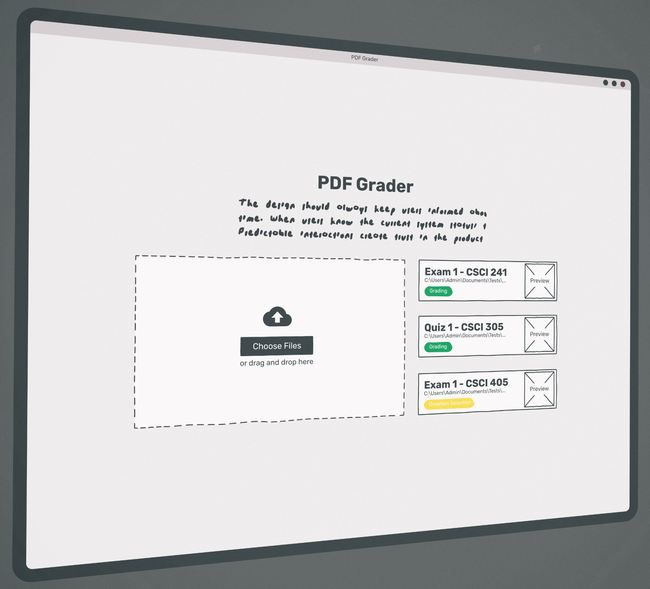

# PDF Grader
> Test grading is a time-consuming task that professors have to go through. More and more often tests are being submitted through web based programs leading to digital files being graded. In order to more efficiently grade it is proposed that a piece of software can help a professor grade a PDF (scanned or digital) file while also speeding the process up by presenting the question in a more efficient order.

[![Build Status][travis-image]][travis-url]

The program will take in one pdf file with multiple tests in it. This means, for a five page test, every five pages is the fifth/last page of each test. You will input how many pages are in a test, and how many questions there are. The professor will then go through each page and drag a box over each question/answer location for the entire test. Using that box, it goes question by question (all the 1s, then all the 2s, etc) of each test for grading.

The grading is not automatic, the professor will be shown the question that is being graded and have an interface where he can type specific feedback for a question and how many points they’re going to lose to be reused on other students answering the same question. There will also be a variety of “canned” answers, but these will be very general. Out of bounds support is needed, so if an answer is trailing off the specified box, they can go to the entire page of that question and then return to the test grading software.

After an initial release more features may be added like allowing two or more people to run this software at the same time and thus be able to grade with a TA, as well as a barcode recognition to be able to automatically gather information.

Once the tests have been graded, the software will generate a table of scores as a pdf, and a pdf for each student. This pdf for the student will be as many pages as were questions in the test, and list their feedback that they received on each question (1 question per page).

## Development setup

#### Recommended Tools:
- Java 17 with javafx 17.0.1
- [Intellij IDEA](https://www.jetbrains.com/idea/)
- [SceneBuilder](https://gluonhq.com/products/scene-builder/) for adjusting UI elements.

#### For IntelliJ IDEA:
- Add the repo and clone the project using `File>New>Project From Version Control` or using the `Get from VCS` button on the home page.
  - This should autopopulate if you log into Github.
- Add a new 'Application configuration under `Run>Edit Configurations...` or at the top right under `Add Configuration...`
- Confirm you are using `Java 17` and choose a main class using the icon on the right, should be `com.gradeflow.pdfgrader.PDFGrader`
  - The main class should autopopulate, if it does not there may be a problem.
- Add a name at the top and hit Apply or OK.
- The project should now run.

#### Troubleshooting tips:
- On the far right there is a 'Maven' tab, within that tab there is `pdfgrader>lifecycle>install` this should install everything in the pom.xml file.
- Sometimes a convenient little Maven icon pops up in the top right when looking at `pom.xml` click that if possible. 

For more info go to the openjfx docs:
https://openjfx.io/openjfx-docs/#IDE-Intellij

## Release History

* 0.1
  * All pages implemented
  * No Export Functionality
* 0.8
  * Added test exporting
  * Added statistics template exporting (unfinished)
  * Added file save and load
* 1.0
  * Pages stay sized throughout application
  * Exporting now comes with statistics
* 1.5
  * UI Redesign
  * Hotkeys/Shortcuts
  * Recent Files
  * Tests can be saved and opened later
  * Multiple pdfs will be merged when importing

<!-- Markdown link & img dfn's -->
[travis-image]: https://img.shields.io/travis/dbader/node-datadog-metrics/master.svg?style=flat-square
[travis-url]: https://travis-ci.org/dbader/node-datadog-metrics
